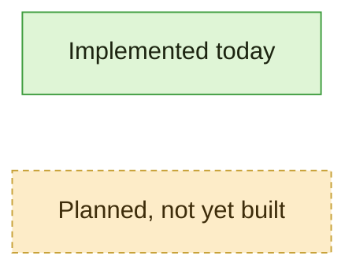
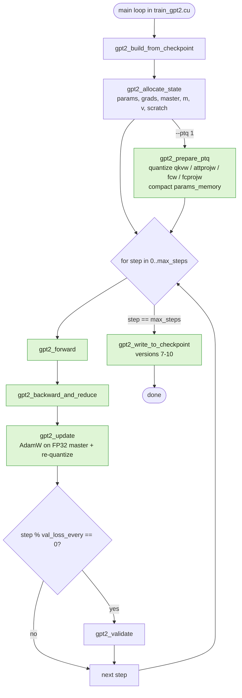
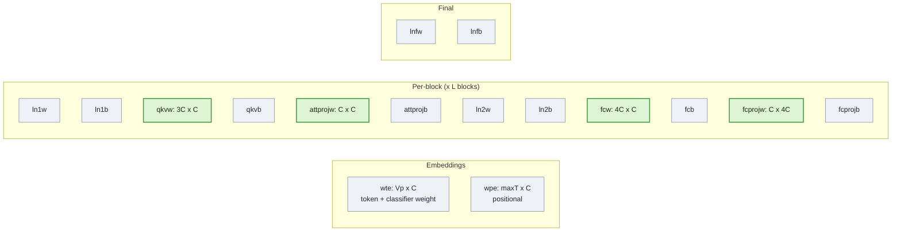
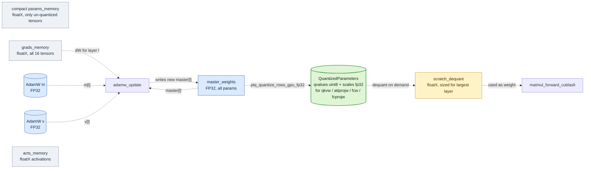
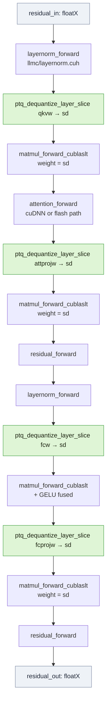
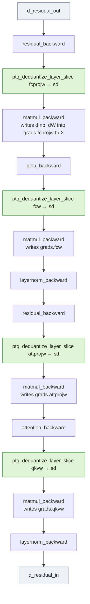
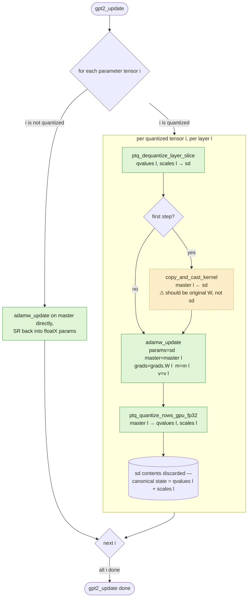
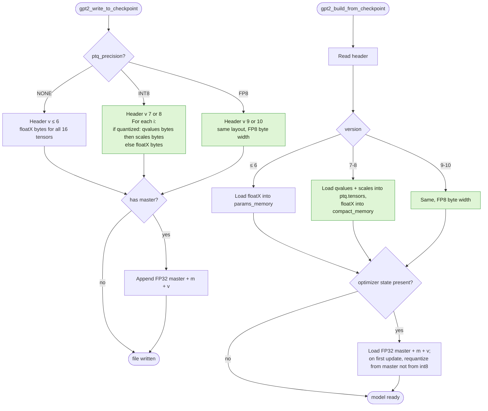
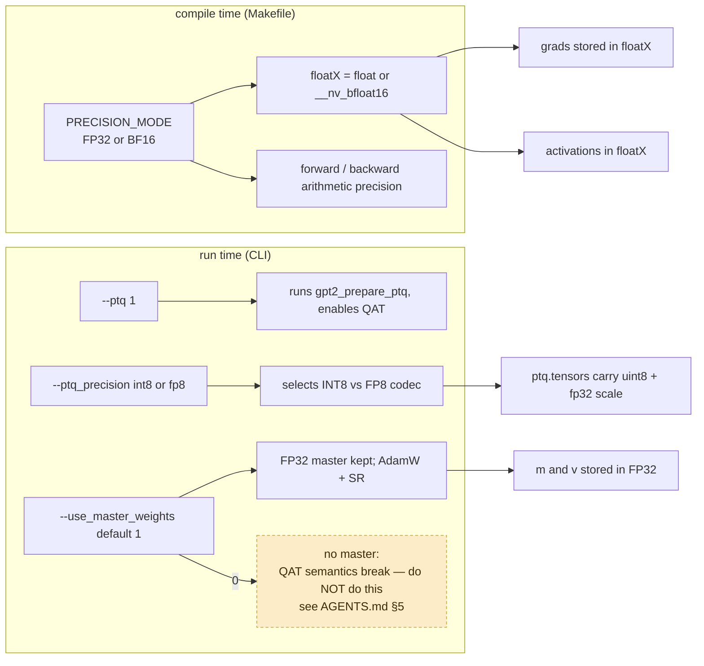

# ARCHITECTURE.md — Code-flow diagrams for `quantized_llm.c`

> **Purpose.** A visual map of the codebase you can scan when you need to
> understand "what calls what" or "where does the quantized weight live at
> step N". Diagrams are Mermaid; any modern Markdown viewer (VS Code,
> GitHub, IntelliJ, Obsidian) renders them.
>
> **This file is meant to track the code, not the plan.** When the code
> changes, this file changes. See [§13 Update protocol](#13-update-protocol)
> for the rule.
>
> **Last synced to code:** 2026-04-30
> **Synced against branch:** `FP8-fix`
> **Synced against phase:** Phase 1 — Weight-only QAT (see
> [`STATUS.md`](./STATUS.md), [`PHASES.md`](./PHASES.md))

---

## Table of contents

1. [How to read this file](#1-how-to-read-this-file)
2. [Top-level training step](#2-top-level-training-step)
3. [Parameter tensor layout](#3-parameter-tensor-layout)
4. [Memory layout while training](#4-memory-layout-while-training)
5. [One-time quantization setup — `gpt2_prepare_ptq`](#5-one-time-quantization-setup--gpt2_prepare_ptq)
6. [Forward pass — one transformer block](#6-forward-pass--one-transformer-block)
7. [Backward pass — one transformer block](#7-backward-pass--one-transformer-block)
8. [Optimizer step — `gpt2_update` with QAT](#8-optimizer-step--gpt2_update-with-qat)
9. [Per-row symmetric absmax — the math](#9-per-row-symmetric-absmax--the-math)
10. [FP8 E4M3 codec](#10-fp8-e4m3-codec)
11. [Checkpoint save / load](#11-checkpoint-save--load)
12. [Build & precision flags](#12-build--precision-flags)
13. [Update protocol](#13-update-protocol)

---

## 1. How to read this file

- Each diagram is grounded in real functions in the codebase. Every box that
  names a function (e.g. `gpt2_prepare_ptq`) corresponds to a function you
  can grep for. The most important function appearances also have a
  `file:line` citation in the prose underneath the diagram.
- **Solid arrows = control flow** (A calls B). **Dashed arrows = data flow**
  (A's output is read by B).
- Boxes shaded with `:::current` are implemented today. Boxes shaded with
  `:::planned` are referenced in `PHASES.md` but not yet in the code. If you
  see a `:::planned` box that has actually been built, that is a bug in this
  file — fix it (see §13).



---

## 2. Top-level training step

The training driver in `train_gpt2.cu` calls three functions per step:
forward, backward, update. Validation, sampling, and HellaSwag eval are
periodic side-quests.



Anchors:

- `gpt2_build_from_checkpoint` — `train_gpt2.cu:1073`
- `gpt2_allocate_state` — `train_gpt2.cu:951`
- `gpt2_prepare_ptq` — `train_gpt2.cu:729`
- `gpt2_forward` — `train_gpt2.cu:1330`
- `gpt2_backward_and_reduce` — `train_gpt2.cu:1505`
- `gpt2_update` — `train_gpt2.cu:1777`

---

## 3. Parameter tensor layout

GPT-2 has **16 parameter tensors** (constant: `NUM_PARAMETER_TENSORS`). Only
four are quantized today — the four large transformer matrices.



Green tensors are stored as `(qvalues, scales)` after `gpt2_prepare_ptq`.
Everything else stays in `floatX` (BF16 or FP32 depending on
`PRECISION_MODE`). The decision lives in `ptq_should_quantize_tensor()`
(`train_gpt2.cu` near the `PTQPrecision` enum).

> **Deliberately not quantized today**: `wte` (also reused as the classifier
> matmul weight — flagged in `QAT_REPORT.md §4.7`), `wpe`, all biases, all
> LayerNorm gammas/betas. This is the agreed scheme for Phase 1.

---

## 4. Memory layout while training

These are the device-resident buffers in play once a QAT step is running.
Boxes named in green are the things that physically hold weight bits in
INT8/FP8; everything else is the usual `llm.c` machinery.



Key lifecycle facts (cite `agent/QAT_REPORT.md §2.3, §2.5`):

- After `gpt2_prepare_ptq()`, `params.qkvw / attprojw / fcw / fcprojw` are
  set to `nullptr`. The canonical storage is `model->ptq.tensors[i]`.
- `scratch_dequant` is a single buffer big enough for the largest single
  layer's weight (so `4*C*C` floatX elements). It's reused across layers
  and across forward → backward.
- `master_weights` is FP32 for every tensor (quantized or not). For
  quantized tensors it is the source of truth between steps; for
  unquantized tensors it is the high-precision shadow used by AdamW + SR.

---

## 5. One-time quantization setup — `gpt2_prepare_ptq`

Called once after `gpt2_build_from_checkpoint` if `--ptq 1` is passed. Does
four things in order.

```mermaid
flowchart TD
    start([gpt2_prepare_ptq]) --> a1[For each i in {qkvw, attprojw, fcw, fcprojw}:<br/>allocate qvalues uint8, scales fp32]
    a1 --> a2[ptq_quantize_rows_gpu<br/>source = floatX params_memory<br/>per-row symmetric absmax]:::current
    a2 --> a3[Build compact_memory:<br/>floatX storage for the 12 unquantized tensors only]
    a3 --> a4[Free original full params_memory]
    a4 --> a5[Set params.qkvw / attprojw / fcw / fcprojw = nullptr]
    a5 --> a6[Allocate scratch_dequant<br/>size = max_layer_elems * sizeof(floatX)]
    a6 --> done([ready for training])

    a2 -. ⚠ also see STATUS.md §1, §2 .-> warn[/Master init bug:<br/>FP32 master is later set from dequant(qvalues),<br/>not from original floatX weights/]:::planned

    classDef current fill:#dff5d6,stroke:#3f9d3f,color:#1c2410
    classDef planned fill:#fdecc8,stroke:#c8a23a,color:#3d2c0a,stroke-dasharray: 4 3
```

Anchor: `gpt2_prepare_ptq` lives at `train_gpt2.cu:729`. The quantizer
kernels it calls live in the `ptq_*` block at `train_gpt2.cu:204..322`.

The dashed orange box is the pending fix in `STATUS.md` §"Phase 1 cleanup"
item 1 — the FP32 master is initialized from already-rounded values today.
When that's fixed, change this diagram to remove the warning.

---

## 6. Forward pass — one transformer block

The forward pass for a single block. The "dequantize-on-demand" pattern is
called four times per block per step (one per quantized matmul).



Anchors:

- `ptq_dequantize_layer_slice` — `train_gpt2.cu:322`
- `matmul_forward_cublaslt` — `llmc/matmul.cuh:231`
- `attention_forward` — `llmc/attention.cuh:195`
- `gpt2_forward` (where this block sequence is unrolled L times) —
  `train_gpt2.cu:1330`

> **What the matmul kernel sees.** Always dequantized `floatX`. There is
> **no INT8 GEMM today**. Speed-up from quantization is purely memory; the
> matmul tensor cores run the same arithmetic as the BF16 baseline. This is
> the gap that Phase 4 in `PHASES.md` would close.

---

## 7. Backward pass — one transformer block

Mirror image of forward. Dequant happens again for the same four weights
(once per layer per step). `dW` lands in `grads_memory` in `floatX`.



Anchors:

- `matmul_backward` — `llmc/matmul.cuh:244`
- `attention_backward` — `llmc/attention.cuh:239`
- `gpt2_backward_and_reduce` — `train_gpt2.cu:1505`

> **STE without saying so.** The backward pass treats `dequant(quant(W))`
> as identity for gradients: `dW` ends up in `grads.qkvw[l]` indexed against
> the *dequantized* weight, but it is then handed to `adamw_update` which
> writes the FP32 *master*. That is the textbook straight-through estimator
> for weight-only QAT. See `QAT_REPORT.md §3` for the algebra.

---

## 8. Optimizer step — `gpt2_update` with QAT

The most subtle part of the QAT loop. Per quantized tensor, per layer:



Anchors:

- `gpt2_update` — `train_gpt2.cu:1777`
- `adamw_update` (device fn) — `llmc/adamw.cuh:19`
- `adamw_update` (host launcher) — `llmc/adamw.cuh:75`
- `ptq_quantize_rows_gpu_fp32` — `train_gpt2.cu:306`

The orange box is the master-init bug from `STATUS.md` Phase 1 cleanup
item 1. When fixed, the diagram should drop the `⚠` line and the planned
shading.

---

## 9. Per-row symmetric absmax — the math

This is the only quantization scheme used today. INT8 path; FP8 path is in
§10. The kernels live near `train_gpt2.cu:204..322` (`ptq_find_row_max_kernel`,
`ptq_write_scales_kernel`, `ptq_quantize_apply_kernel`,
`ptq_dequantize_layer_slice`).

```mermaid
flowchart LR
    src[(W_fp32: rows x cols)]:::data
    src --> rmax[per-row absmax<br/>m_r = max_j |W r,j|]
    rmax --> sc[scale_r = m_r / 127<br/>fallback 1.0 if m_r == 0]
    sc --> q[q r,j = round W r,j / scale_r<br/>clamp -127, 127]:::current
    q --> store[(qvalues uint8 reinterpret int8<br/>scales fp32, length = rows)]:::quant

    store -. read .-> dq[W_dq r,j = scale_r * int8 q r,j]:::current
    dq --> use[(scratch_dequant: floatX<br/>used by matmul_forward_cublaslt)]:::scratch

    classDef current fill:#dff5d6,stroke:#3f9d3f,color:#1c2410
    classDef quant fill:#dff5d6,stroke:#3f9d3f,color:#1c2410,stroke-width:2px
    classDef scratch fill:#fef3c7,stroke:#b88a14,color:#3d2c0a
    classDef data fill:#eef2f7,stroke:#7e8aa3,color:#1f2738
```

Important constants and choices (do not silently change — see
[`AGENTS.md` §5](../AGENTS.md)):

- Quant range: **`[-127, 127]`**, not `[-128, 127]`. True-symmetric, costs
  one int8 step but keeps `dequant(quant(0)) == 0` exact.
- No zero-point, no per-tensor scale, no per-group scale. Strictly per-row.
- Scale dtype is FP32 (one float per row, regardless of `floatX`).
- Three implementations exist: host reference (`ptq_quantize_rows_host`),
  GPU from-floatX (`ptq_quantize_rows_gpu`, used during `gpt2_prepare_ptq`),
  GPU from-FP32 (`ptq_quantize_rows_gpu_fp32`, used during every step
  inside `gpt2_update`).

---

## 10. FP8 E4M3 codec

Selected with `--ptq_precision fp8`. Same per-row absmax pattern as INT8,
but the quant grid is the FP8 E4M3 encoding (`max ≈ 448`, sign + 4-bit
exp + 3-bit mantissa, bias 7).

```mermaid
flowchart LR
    w[W_fp32 row]:::data --> mx[m_r = max_j |W r,j|]
    mx --> s[scale_r = m_r / 448.0]
    s --> e[ptq_encode_fp8_e4m3<br/>hand-rolled bit-packing]:::current
    e --> q[(qvalues uint8 = E4M3 byte<br/>scales fp32)]:::quant
    q --> d[ptq_decode_fp8_e4m3<br/>scale_r * decoded value]:::current
    d --> sd[scratch_dequant floatX]:::scratch

    classDef current fill:#dff5d6,stroke:#3f9d3f,color:#1c2410
    classDef quant fill:#dff5d6,stroke:#3f9d3f,color:#1c2410,stroke-width:2px
    classDef scratch fill:#fef3c7,stroke:#b88a14,color:#3d2c0a
    classDef data fill:#eef2f7,stroke:#7e8aa3,color:#1f2738
```

> **Risk flag.** The codec is hand-rolled. Until `dev/test/` has a
> round-trip test against `cuda_fp8.h`'s `__nv_fp8_e4m3` (Phase 1 cleanup
> item 2), treat numerical results from the FP8 path as provisional. See
> `QAT_REPORT.md §4.6`.

---

## 11. Checkpoint save / load

Versions of the model header file:

| Version | Meaning |
| --- | --- |
| `≤ 6` | Original `llm.c` floatX checkpoint. |
| `7` | INT8 weights, no master in this file. |
| `8` | INT8 weights + FP32 master sidecar. |
| `9` | FP8 weights, no master. |
| `10` | FP8 weights + FP32 master. |



> Resuming from a `(quantized weights + FP32 master)` checkpoint is the
> precision-clean path: `gpt2_update`'s first re-quant runs from master, so
> we don't pay double rounding. Resuming from a quantized-only checkpoint
> reproduces the master-init bug in §8 — a single round of additional
> quant noise is baked in on the first step.

---

## 12. Build & precision flags

The two compile-time and two run-time switches that change everything in
this file:



The "no master" branch is shown only because it is a flag the optimizer
exposes — it is **not** a supported configuration for the QAT path and
must not be flipped without an explicit decision logged in `STATUS.md`.

---

## 13. Update protocol

This file falls out of sync with the code very quickly if it isn't actively
maintained. Rules for keeping it correct:

1. **Whenever `STATUS.md` gets a new "Recent changes" entry that touches
   the quantization data flow, weight memory layout, optimizer step, or
   checkpoint format, update the relevant section here in the same
   change.** Bump the *Last synced to code* date at the top.
2. **Whenever a `:::planned` box becomes implemented, change it to
   `:::current` and remove any "⚠ pending" notes that referred to it.**
   Likewise, if a current behavior is removed, prune the box.
3. **When you add a new section, also add it to the Table of Contents.**
4. **Anchors are part of the contract.** If you rename or move a function
   listed in an "Anchors:" sub-section, fix the line number citation (or
   drop the line number and keep just the file, if the function moves
   often).
5. **Don't merge multiple plan items into one diagram.** Phase 2 (FP8
   optimizer state), Phase 3 (activation quant), and Phase 4 (INT8 GEMM)
   each get their own section *when they land*, not before. Keeping
   un-built phases out of the diagrams is the whole point of distinguishing
   `:::current` from `:::planned`.
6. **For agents (Claude / Cursor / Codex / etc.): you are expected to
   update this file as part of the same change that touches the code.**
   This is now part of the "Files you must keep up to date" rule in
   `AGENTS.md` §6.

If you're unsure whether a change warrants a diagram update, the test is:
*would the next person reading this file get the wrong mental model
without the change?* If yes, update.

---

## Pointers

- Repo entry point for agents: [`AGENTS.md`](../AGENTS.md)
- Current state: [`STATUS.md`](./STATUS.md)
- Plan: [`PHASES.md`](./PHASES.md)
- Deep-dive on quantization implementation: [`QAT_REPORT.md`](./QAT_REPORT.md)
- For humans: [`AGENT_GUIDE.md`](./AGENT_GUIDE.md)
